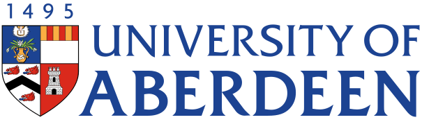
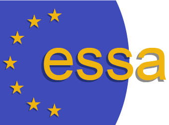
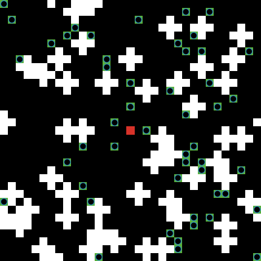
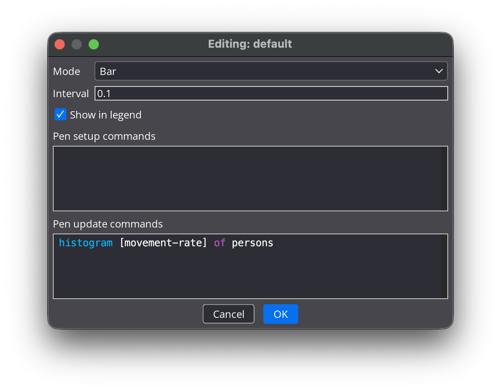
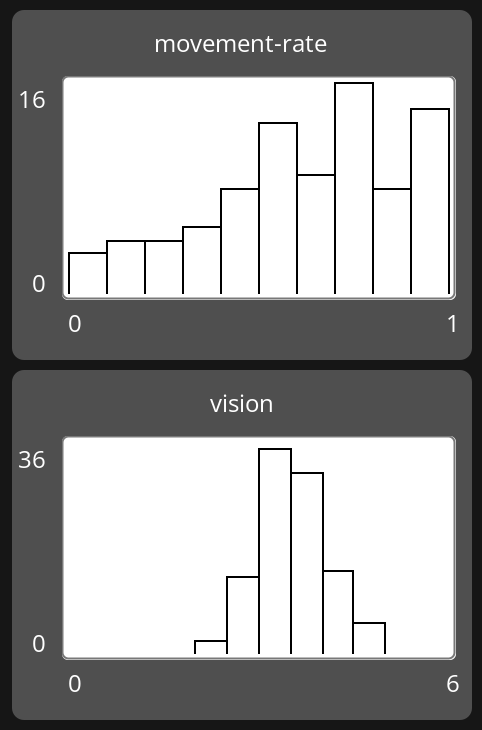
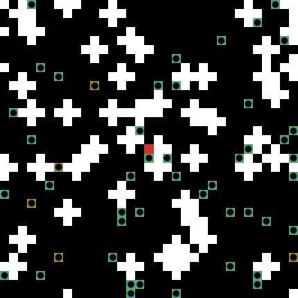
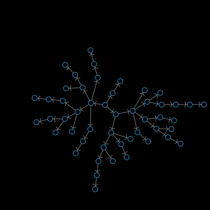
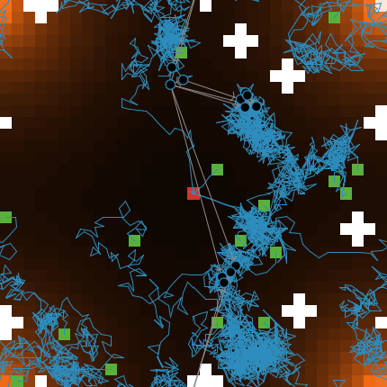

<!-- .slide: class="title-slide" -->
# Programming ABMs in NetLogo

<p class="author-list">Gary Polhill<sup>1</sup><p>

<p class="affil"><sup>1</sup> The James Hutton Institute</p>

<div class="logo-strip">
<div class="logo-box"></div>
<div class="logo-box"></div>
<div class="logo-box"></div>
<div class="logo-box"></div>
</div>

<!-- ADAPTATION NOTE: built from the course-plan bullets in
     day_03/presentation.md ("Sessions 1 and 2: Programming ABMs in NetLogo,
     2.5h") -- there was no raw slide-text source for this day the way
     "D2s1 and s2.md" existed for Day 2, so this is original content
     written to the stated brief, not a condensed transcription. It reuses
     the Day 2 workplace disease-transmission model as a running example
     for continuity across the week. Card templates for decision-making /
     social / environmental dynamics are referenced throughout (per the
     course plan) but don't exist in the repo yet -- flagged inline with
     TODOs where they'd slot in. -->

---

# Outline

+ Model ontology and representation
+ `setup` and `go`: the skeleton of every ABM
+ Social networks
+ Decision-making and environmental dynamics

---

<!-- .slide: class="section-title-purple" -->
# Model ontology
## and representation

---

# Your model is its own language

+ Recall: all programming languages are formal languages -- a fixed vocabulary, a fixed grammar
+ When you write `breed [ persons person ]`, you're not just satisfying NetLogo's syntax -- you're declaring that **"person" is a category of thing that exists** in your model's universe
+ Every `breed`, every `-own` attribute, every link breed is an **ontological commitment**: a claim about what kinds of things, and what kinds of relationships, are real enough in your system to represent

<p class="fragment">You're effectively fine-tuning NetLogo into a small, bespoke formal language whose vocabulary <em>is</em> your theory of the system.</p>

---

# Discussion

+ For the model your group is working on this week: what's one thing you're tempted to leave out of your ontology that a domain expert might insist matters?
+ What's one thing you're tempted to include that might not earn its place?

<p class="fragment">There's rarely a clean answer -- the exercise is noticing you're <em>choosing</em>, not discovering a pre-existing truth about the system.</p>

---

<!-- .slide: class="section-title-blue" -->
# `setup` and `go`
## The skeleton of every ABM

---

# Two procedures carry the whole model

+ **`setup`** &mdash; initialization: build the world and its agents into a defined starting state
+ **`go`** &mdash; scheduling: define, once per tick, the order in which things happen

Everything else you write is either called *from* one of these, or exists to support something that is.

--

# Designing top-down

A useful discipline for today and this week:

1. Write `setup` and `go` **first**, as empty procedure stubs -- just the names of the steps, no bodies yet
2. Get the model to run (doing nothing) with that skeleton
3. Fill in **one stub at a time**, testing as you go

```netlogo
to setup
  clear-all

  initialize-environment
  create-agents

  reset-ticks
end

to go
  update-environment
  ask my-agents [ decide-and-act ]

  tick
end

to create-agents end
to initialize-environment end
to update-environment end
to decide-and-act end
```

+ Forces you to settle the **ontology and scheduling questions first**, before getting lost in the details of any one rule

---

# It's not the only way

  + **Bottom-up**: fully implement one behaviour (e.g. movement) first, and only write the overall schedule once you know what pieces exist

  + **Iterative**: get something crude running end-to-end, then add complexity in passes

  + All three are legitimate &mdash; we're teaching top-down because it forces the ontology conversation early, which is the hard part in a group

---

# Naming the entities...

  + Entities are the objects and agents that make up your model
  + Different categories of entity are called **breeds** in NetLogo

```netlogo
breed [ persons person ]
breed [ mice mouse ]
```

  + Square brackets hold the plural and singular forms, which must differ
    + Problem case (in English): sheep is singular and plural!
    + `breed [ many-sheep one-sheep ]`?
  + Breed declarations appear before `setup`

---

# Attributes

+ Attributes are data about individual agents that are relevant to the model
+ Two purposes:
  + **State variables** &mdash; how do you tell one agent apart from another? What makes this one different?
  + **Useful computational variables** &mdash; save time by storing a value with the agent instead of recomputing it
    + There is a general time/memory trade-off in computing

---

# Declaring attributes

```netlogo
turtles-own [ n-limbs ]
persons-own [ education-level ]
patches-own [ coverage ]
```

+ `turtles-own [ ]` &mdash; attributes of *all* agents
+ `breeds-own [ ]` (plural breed name) &mdash; attributes of one particular breed
+ `patches-own [ ]` &mdash; attributes of patches

<p class="fragment">Indent your code consistently &mdash; it makes it far more readable. Develop a style and stick to it.</p>

---

# Let's continue with the evacuation model...

  + So far, we have a crude reimplementation of Matt's evacuation model
  + When the tables and chairs are arranged in a disordered way, sometimes there are agents who cannot get out
    + Maybe the movement rules could be improved
  + But for now, let's improve the nomenclature
    + We are not modelling turtles exiting a room!

---

# Exercise

  + Declare a `breed` (I will assume `persons`, you can use whatever you like) and reword your code to use it
    + This is known as 'refactoring' in the industry
    + It is a common activity when preparing code, and worth getting used to
    + Version control is how you manage regret...

  + Generally, we would not use `size` and `shape` unless that's what we _mean_
    + People are not geometric shapes
    + Let's instead give our `persons` a `movement-rate` (in the range ]0, 1]), a `personal-space` (in the range [0.5, 1.5[), and a `vision` (in the range [1, 10[)

  + Add these attributes to your `breed`

--

# Answer

```
globals [
  min-movement-rate
  max-movement-rate
  min-personal-space
  max-personal-space
  min-vision
  max-vision
]

breed [ persons person ]
persons-own [
  movement-rate ; how fast can they move? (patches/tick)
  personal-space ; how far do they need to be from the nearest other agent? (patches)
  vision ; how far can they see? (patches)
]

to init
  set min-movement-rate 0
  set max-movement-rate 1
  set min-personal-space 0.5
  set max-personal-space 1.5
  set min-vision 1
  set max-vision 6
end

to setup
  clear-all
  init
```

---

# Free classes!

+ The **world** on the Interface tab is divided into square cells called `patches`
  + "Patch" is terminology borrowed from ecology
  + Gives spatial locations for agents &mdash; useful for visualization even in models without real space
+ All agents in the model are called `turtles`
  + Dating back to the "Logo" family of languages, where programs instructed a turtle to draw pictures
  + All instances of a specific `breed` are also a `turtle`
    + Limited class hierarchy

---

# Free attributes!

Every turtle already has these, whether you declare them or not:

| Attribute | Notes |
|---|---|
| `breed`, `who` | breed membership; a unique creation-order number |
| `xcor`, `ycor` | position |
| `heading` | 0 is north/up |
| `color`, `shape`, `size` | appearance |
| `label`, `label-color` | text shown next to the turtle |
| `hidden?` | visible or not |
| `pen-mode`, `pen-size` | drawing trail behaviour |

---

# Default values

+ If you want to change a default, you have to write the code to do it
+ Random `heading`, random `color`, `"default"` `shape`, `size 1`
+ `xcor` and `ycor` start at 0 &mdash; remember we had to use `move-to` to get agents somewhere else
+ Empty `label`, `hidden? false`, `pen-mode "up"`
+ `who` is assigned in creation order

---

# Default patch attributes

```netlogo
ask patch 0 0 [
  set plabel (word "patch " pxcor " " pycor)
  set plabel-color green
  set pcolor brown - 1
]
```

+ `pcolor`, `plabel`, `plabel-color`, `pxcor`, `pycor`

You use `patches-own [ ]` to give `patches` attributes

---

# Useful shortenings to save typing

| Prefix | Meaning |
|---|---|
| `n-`_variable_ | number of |
| `t-`_variable_ | total |
| _variable_`-t` | time |
| `p-`_variable_ | probability of, or proportion of |
| `pct-`_variable_ | percentage |
| _variable_`-var` | variance |

Remember: `?` for Booleans, `%` for percentages, at the end of the name.

  + N.B. I tend to avoid using percentages in variables
    + Messes with arithmetic operations &mdash; need to keep remembering to divide by 100
    + Can always _display_ as a percentage to the user by multiplying by 100 and appending a `%` sign
      + `(word (p-infected * 100) "%")

---

# Exercise: let's initialize some attributes

  + Use your `create-persons n-agents []` code block to assign some initial values to `movement-rate`, `personal-space` and `vision`.
  
  + We want slow `movement-rate`s to be rare, and to maintain the minimum and maximum specified. Use `random-exponential` (see the dictionary). The mean of the exponential distribution should be the mean of the minimum and maximum (0.5). 
    + Set the `movement-rate` to the maximum if you end up with a `movement-rate <= 0`

  + We want `personal-space` to be uniformly sampled. Use `random-float`

  + We want `vision` to have a peaked 'normal-ish' distribution with variance set by the user, and mean half way between the minimum and maximum.
    + You can use `random-normal` to sample, but that risks getting samples outwith the required bounds. You should resample until the number sampled is in bounds.
      + Probably not a good idea to allow the variance to be set too high...

  + Delete the code setting `shape`, `color` and `size` and choose values yourself

+ N.B. 1: All `-own` attributes are 0 unless you set them 
+ N.B. 2: **Literals** are fixed values: Booleans (`true`/`false`), numbers (`0`, `1`), strings (`"person"`), colours (`pink`, `blue`, `green` &mdash; see Tools >> Color Swatches)

--

<!-- .slide: class="right-image-slide" -->

# Answer

<div class="split">
  <div class="split-text">

Code to initialize `persons` in `setup`:

```netlogo
  create-persons n-agents [
    set shape "circle 2"

    set movement-rate max-movement-rate - (
      random-exponential mean (list min-movement-rate max-movement-rate)
    )
    if movement-rate <= min-movement-rate
      or movement-rate > max-movement-rate
    [
      set movement-rate max-movement-rate
    ]
    set personal-space min-personal-space
      + random-float (max-personal-space - min-personal-space)

    ; N.B. vision 0 by default; assume min-vision is not negative
    while [vision <= min-vision or vision > max-vision] [
      set vision random-normal
        (mean (list min-vision max-vision)) vision-var
    ]
    
    set color sky
    set size 0.9
    move-to one-of patches with [
      pcolor = green and not any? turtles-here
    ]
  ]
```

It's long enough now that we might want it in its own procedure

  + You could check the distributions of your agents' `movement-rate`s, `personal-space`, and `vision` using a plot

  </div> <div class="split-image">



  </div>
</div>

---

<!-- .slide: class="right-image-slide" -->

# Using plots to get a histogram

Configure the plot pen &mdash; note Mode, Interval, and Pen update commands

<div class="split">
  <div class="split-image">



  </div>

  <div class="split-image">



  </div>
</div>

---

<!-- .slide: class="right-image-slide" -->

# ask, with, count

<div class="split">
  <div class="split-text">

```netlogo
ask persons with [ movement-rate < 0.1 ] [
  set color red
]

show count persons with [ movement-rate < 0.1 ]
```

+ `ask` tells a set of agents to do something
+ `with [ ]` selects a subset &mdash; put a Boolean expression inside, using `=`, `>`, etc.
+ `count` tells you how many members a set has
+ `turtles-here` and _breeds_`-here` tells you what's on the current patch

  </div> <div class="split-image">



  </div>
</div>

---

# "Global" attributes

+ Sometimes it helps to have a variable accessible from _anywhere_ &mdash; not just turtles, patches or links
+ Useful for: caching expensive-to-calculate values, properties of the whole "world", filenames, time series
+ Some programmers frown on them &mdash; they make code more interdependent
+ Declare at the top of your code (and why not add a comment...):

```netlogo
globals [
  t-distance-walked   ; Accumulator of total distance walked to evacuate
]
```

---

# Relations &mdash; the theory

+ Mathematically, a relation maps members of a set onto another set (or the same set)
+ Doesn't have to hold for every member
+ Various properties: transitivity, symmetry, reflexivity...
+ Can be thought of as a matrix of Booleans &mdash; `true` where the relation holds, `false` where it doesn't (symmetric relations only need a triangular matrix)
+ Examples: `greater-than` (numbers), `parent-of` (people)

---

# Relations in NetLogo: links

+ NetLogo calls relations **links** &mdash; generally used for social networks
+ All links are **irreflexive** &mdash; an agent cannot link to itself

```netlogo
undirected-link-breed [ siblings sibling ]
directed-link-breed [ parents parent ]
```

+ **Symmetric** relations: `undirected-link-breed [ ` _plural_ _singular_ ` ]`
+ **Not (necessarily) symmetric**: `directed-link-breed [ ` _plural_ _singular_ ` ]`
  + Not the same as *anti*symmetric &mdash; if _A_ manages _B_ on one project and _B_ manages _A_ on another, _A_ and _B_ are not the same person!

---

# What is an agent? (revisited)

+ In NetLogo, lots of things count as agents: turtles, patches, links, and any breeds/link-breeds we declare
+ From a software perspective, what actually _makes_ something an "agent"? Autonomy, goals, reasoning, acting on behalf of a human, special interaction protocols...
+ Software agents and agent-based models are genuinely separate fields
+ Pragmatism is a philosophy: **one thing that doesn't work is getting hung up for ages on what an agent is**

---

# "Reified" relations

```netlogo
friends-own [ friendversary ]  ; date the friendship was formed
```

+ _link-breeds_`-own [ ]` &mdash; gives relations their own attributes
+ Computer scientists call this "reifying" a relation &mdash; nothing to worry about in NetLogo, just a useful trick

---

## Default link attributes

+ Commonly used: `end1`, `end2`, `hidden?`
+ Visualization: `color`, `shape`, `thickness`, `label`, `label-color`
+ Others: `breed`, `tie-mode`

---

# Exercise: Let's build a workplace social network

**Management hierarchy** &mdash; for each person, think from their own perspective:

+ Who could manage _me_? If I'm not managed yet, and someone could manage me, pick one
+ Whom could _I_ manage? If I don't manage anyone, and someone needs managing, pick one

+ N.B. There are much easier ways to build networks (the `nw` extension helps a lot) &mdash; but we're doing it by hand once, deliberately

First, the declaration:

`directed-link-breed [manages manage]`

OR

`undirected-link-breed [manages manage]`

?

+ Can you `ask persons [ ` _something_ ` ]` that will create that hierarchy?

---

# Building the network, step by step

Find me a manager!

```netlogo
ask persons [
  let management other persons with [
    any? out-manage-neighbors
  ]
  if (not any? in-manage-neighbors) and (any? management) [
    create-manage-from one-of management
  ]
]
```

+ `ask` a group of agents to do something 
+ `let` creates a temporary variable -- here, `management` 
+ `other persons` -- everyone except the agent running the code 
+ `with [ ]` selects a subset; `out-manage-neighbors` follows a directed link outward; `any?` is true if the set isn't empty 
+ `if [ ]` runs code only when a Boolean expression is true 
+ `create-manage-from` makes a directed link **to** us **from** someone else 

---

# Exercise: Finishing the hierarchy

  + Who could manage _me_? If I'm not managed yet, and someone could manage me, pick one
    + I've shown you how to do that
  + Whom could _I_ manage? If I don't manage anyone, and someone needs managing, pick one
    + Can you now do this? You need to add two things in comments to what we have already done

```netlogo
ask persons [
  let management other persons with [
    any? out-manage-neighbors
  ]
  if (not any? in-manage-neighbors) and (any? management) [
    create-manage-from one-of management
  ]

  ; find everyone who is not managed by anyone
  ; and isn't in the management team

  ; if I don't manage anyone and there are any people
  ; to manage, then make a manage link to one of them
]
```

--
<!-- .slide: class="right-image-slide" -->

# Answer: Finishing the hierarchy, and showing it off

<div class="split">
  <div class="split-text">

```netlogo
ask persons [
  let management other persons with [
    any? out-manage-neighbors
  ]
  if (not any? in-manage-neighbors) and (any? management) [
    create-manage-from one-of management
  ]
  let unmanaged other persons with [
    (not any? in-manage-neighbors) and (not member? self management)
  ]
  if (not any? out-manage-neighbors) and (any? unmanaged) [
    create-manage-to one-of unmanaged
  ]
]

layout-radial persons manages (
  one-of persons with [ not any? in-manage-neighbors ]
)
```

+ `self` is the agent currently executing the code
+ `layout-radial` arranges a network starting from one agent at the centre -- here, someone unmanaged
+ Using temporary variables (`management`, `unmanaged`) avoids reconstructing the same set twice -- more readable, and saves computing time
+ Visualization is a great way to check your code is doing what you think

  </div> <div class="split-image">



  </div>
</div>

---

<!-- .slide: class="section-title-green" -->
# Implementing rules and functions

---

# From English to NetLogo

+ You already have the tools: reporters and procedures
+ The new skill is **translation** &mdash; taking a sentence you can say about your system and turning it into a reporter or a procedure
+ Worked example: 
  + _A person will face the exit and move towards it if they can see it_

```netlogo
to-report can-see-exit?
  report any? (patches in-radius vision) with [pcolor = red]
end

to move-to-exit
  if can-see-exit? [
    face one-of (patches in-radius vision) with [pcolor = red]
    fd movement-rate
  ]
end
```

+ Naming the reporter after the *question it answers* (`can-work?`) keeps code readable as a sentence in its own right

---

# Exercise

```netlogo
to move-to-exit
  if can-see-exit? [
    face one-of (patches in-radius vision) with [pcolor = red]
    fd movement-rate
  ]
end
```

+ We have not stopped the agent from moving over a table or chair in `move-to-exit`
  + How should we do that?
+ Hint:
  + We should face somewhere else if `patch-ahead movement-rate` is `black` and has no `persons-here` except me...
    + But where...? Let's just assume they don't move for now

--

# Answer

```netlogo
to move-to-exit
  if can-see-exit? [
    face one-of (patches in-radius vision) with [pcolor = red]
    
    if patch-ahead movement-rate = patch-here
    or [(pcolor = black or pcolor = red)
      and not any? persons-here] of patch-ahead movement-rate [
      fd movement-rate
    ]
  ]
end
```

---

# Let's add some more rules

+ Can I see someone else who moved in the last step?
  + Need a `persons-own [ moved? ]` initialized to `false`
  + Set it to `true` if I moved
+ And we need to know the patch we started on &mdash; we could be getting up slowly from our chair!
  + Need `persons-own [ start-patch ` and ` got-up? ]`

```netlogo
to move-to-exit
  (ifelse can-see-exit? [
    face one-of (patches in-radius vision) with [pcolor = red]
  ] can-see-mover? [
    face one-of (persons in-radius vision) with [moved?]
  ] [
    ; do nothing
  ])
  
  if not got-up? or patch-ahead movement-rate = patch-here
  or [(pcolor = black or pcolor = red)
    and not any? persons-here] of patch-ahead movement-rate [
    fd movement-rate
    set moved? true
    if not got-up? [
      set moved? false ; I don't know where I'm going!
      if patch-here != start-patch [
        set got-up? true
      ]
    ]
  ]
  
end
```

---

# Adding a fire

  + Add `patches-own [temperature]`
  + Add a parameter `fire-temperature`
  + And another `fire-spread`
  + In `setup`, set the `temperature` of `patch max-pxcor max-pycor` to fire-temperature
  + In `go`:

```netlogo
ask patch max-pxcor max-pycor [
  set temperature fire-temperature
]
diffuse temperature fire-spread
```

  + If you want to see the effects, you need to do some refactoring
    + We cannot use `pcolor` to tell us that a patch is `walkable?` or `is-exit?` any more

```netlogo
  ask patches with [walkable? and not is-exit?] [
    set pcolor scale-color orange temperature 0 fire-temperature
  ]
```

---

<!-- .slide: class="right-image-slide" -->

# Exercise

<div class="split">
  <div class="split-text">

+ Not all the agents are escaping, still!
+ Try adding some more rules
  + Did my manager move? &mdash; face them!
  + Face a random empty `patch` and move towards it
  + Move away from hotter patches!

+ Try putting `pen-down` in the `create-persons` code block!

  </div>
  <div class="split-image">


 
  </div>
</div>

---

<!-- .slide: class="section-title-purple" -->
# Decision-making

(Separate PowerPoint -- Boo!)

---

## Thank you
<!-- .slide: class="final-slide" -->

With thanks to our sponsors

**BINN** and **ESSA**
