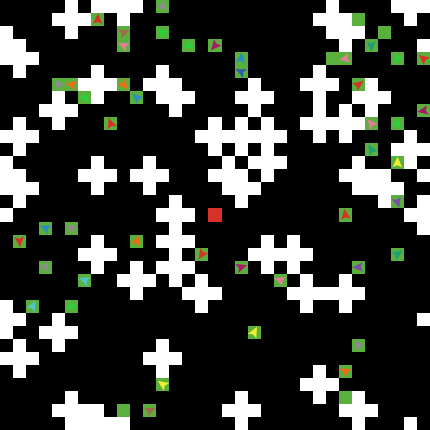
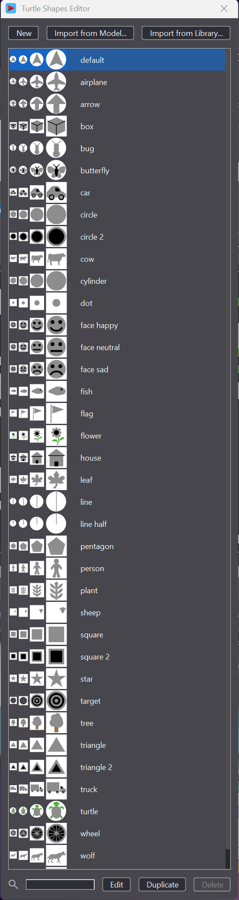
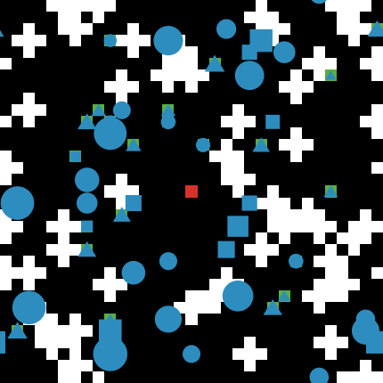
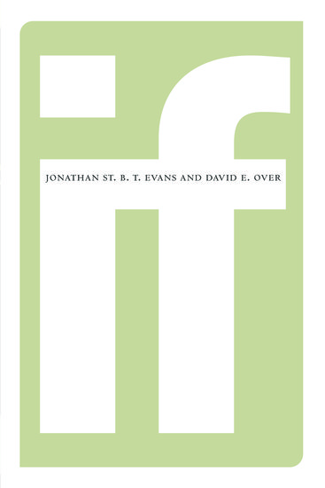

<!-- .slide: class="title-slide" -->
# Programming in NetLogo
## Part 1
<p class="author-list">Gary Polhill<sup>1</sup><p>

<p class="affil"><sup>1</sup> The James Hutton Institute</p>

<div class="logo-strip">
<div class="logo-box"></div>
<div class="logo-box"></div>
<div class="logo-box"></div>
<div class="logo-box"></div>
</div>

<!-- ADAPTATION NOTE for Gary/whoever edits next: rebuilt from
     "D2s1 and s2.md" in this folder. That file also contains a large,
     unrelated block (~540 lines) of guest-lecture material on AI
     decision-making algorithms -- decision trees, case-based reasoning,
     neural networks, FEARLUS/SPOMM -- which doesn't belong to "Programming
     in NetLogo" and has been left out of both this deck and Session 2's.
     It reads like it belongs to a guest lecture slot instead; worth
     checking where (if anywhere) it should live. -->

---

# Outline

+ Natural and formal languages
+ Navigating the NetLogo Code tab
  + A NetLogo "template" model
+ Writing your model structure in NetLogo -- bulk of this talk
  + Agent breeds, attributes, relations
+ Basics of algorithms

---

<!-- .slide: class="section-title-purple" -->
# Before we start
## AI versus DIY

---

# LLMs make you a reviewer, not a developer

+ It's tempting to ask ChatGPT/Copilot to just write the NetLogo for you
+ But then you're **reviewing** code, not **developing** it &mdash; a much harder skill to have first
+ We think it's better to learn to code, *then* use an LLM to generate something you're equipped to review
+ It isn't really fair to ask us to debug ChatGPT's code &mdash; we're here to teach **you**, not the AI

## The deal

+ Please be honest if you've used an LLM
+ The objective isn't to get the answers right &mdash; it's to do the learning that means *you* can get them right
+ Use the exercises today to actually practice writing and checking code yourself

---

# Natural and formal languages

<div class="container">
<div class="col">

### Natural languages
+ Spoken and written by humans (and non-human animals)
+ Meaning comes from norms and context
+ Have grammatical structure &mdash; but we can understand what's meant even when it's not followed exactly

</div>
<div class="col">

### Formal languages
*(Chomsky, 1956)*
+ A finite set of symbols &mdash; you cannot "mis-spell"
+ A formal grammar &mdash; must be adhered to
+ Usually a formal semantics *(Tarski, 1944)* &mdash; relates meanings to mathematics

</div>
</div>

---

## All programming languages are formal languages

+ NetLogo included
+ The computer will not guess what you meant &mdash; only what you wrote

---

# Naming things

Computer code contains two very different kinds of word:

+ Things that make sense **to the computer**
  + Commands, built-in procedures, etc. &mdash; see the NetLogo dictionary
+ Things that make sense **to you**
  + Names for variables, procedures, kinds of agent, etc.
  + These help *you* understand what the code is doing
  + The computer only cares that you use these names **consistently** &mdash; it has no idea what they mean in the real world

---

<!-- .slide: class="section-title-green" -->
# The NetLogo Code tab

---

# Finding your way around

| Feature | What it's for |
|---|---|
| Find... | search the code |
| Check | validates syntax &mdash; happens automatically on tab switch / save |
| Procedures drop-down | jump to any procedure by name |
| Indent automatically | tidies up your code layout |
| Code tab in separate window | useful on a small screen |

---

## A collaboration tip

+ Turn on **Show Line Numbers (in editor)** in preferences
  + Mac: NetLogo >> Settings
  + Windows: Tools >> Preferences
+ Disambiguates what you're referring to when someone says "look at line 42"

---

# An empty model

```netlogo
to setup
  clear-all
  reset-ticks
end

to go
  tick
end
```

+ A **procedure** starts with `to name-of-procedure` and finishes with `end`
+ `clear-all` &mdash; delete everything, start afresh
+ `reset-ticks` &mdash; set the tick counter to 0 and initialize plots
+ `tick` &mdashl advance the tick counter by 1
+ Notice the colour: that's **syntax highlighting**
  + It's not standard, and will change by version and renderer

---

# setup, step and go

+ Add three buttons to the Interface tab that call these procedures
+ **setup** &mdash; initialize the model
+ **go** (forever button) &mdash; run continuously
+ **step** / **go** (once button) &mdash; run a single timestep

---

# Quick question

+ Ignoring the comments, what are **two names** in the empty template model that have meaning to *you*, rather than to the computer?

<p class="fragment">Answer: <strong>setup</strong> and <strong>go</strong> &mdash; the names of the procedures you attach to buttons. You could call them anything &mdash; <code>allez</code>, <code>gehen</code>, <code>carrots</code>, <code>xvc324</code> &mdash; as long as you always use the same name to mean the same thing.</p>

---

# Naming conventions in NetLogo

+ Use lower case &mdash; NetLogo isn't case-sensitive (boo), but upper case reads as **shouting**
+ Begin names with an alphabetic character
+ Can't use spaces inside a multi-word name &mdash; use a `-` instead, e.g. `set-up-the-model`
  + Known as **kebab case**

<p class="fragment">Watch out: to *subtract*, put a space on both sides of the operator &mdash; spaces can be part of the grammar!<br>
<code>a-b</code> is a variable name. <code>a - b</code> subtracts <code>b</code> from <code>a</code>.</p>

---

## Other characters in names

+ Numbers and punctuation are allowed, as long as the name still starts with a letter &mdash; but best avoided, with two exceptions:
  + Boolean variables end with `?` by convention, e.g. `infected?`
  + Some people end percentage variables with `%`
+ Accented characters are allowed too

---

<!-- .slide: class="section-title-blue" -->

# Today, we are learning to code in NetLogo

## Tomorrow, we will look in more detail at coding an agent-based model

---

# What we are learning today

  + Comments
  + Sequence and selection
  + Boolean expressions
  + Iteration
  + Procedures and reporters
  + Lists
  + Implementing mathematical equations

We will introduce each of these and then give you some exercises

We will try and allow you to work at your own pace

---

<!-- .slide: class="section-title-green" -->

# Comments

---

<!-- .slide: class="right-image-slide" -->

# Comments

<div class="split">
  <div class="split-text">

  + Programming languages generally use punctuation characters to mean different things from their meaning in natural languages
    + Punctuation characters are available on most keyboards

  + Comments provide a space for us to write explanatory text about code in natural language
    + They are completely ignored by the computer

  + In NetLogo, a comment begins with a semicolon `;` and ends at the end of the line

  `; this will be ignored by Netlogo`

  `this won't! ; and will cause an error`

  + You can use comments in front of procedure definitions, like for the procedure `transfer-land` in FEARLUS.

  </div>
  <div class="split-image">

```netlogo
;;;;;;;;;;;;;;;;;;;;;;;;;;;;;;;;;;;;;;;;;;;;;;;;;;;;;;;;;;;;;;;;;;;;;;;;
; {land-allocator} transfer-land
;
; Find a new owner for each patch put up for sale by a land-manager. The
; new owner is either a neighbour who can afford the patch-price or a 
; random in-migrant land-manager. There is an equal probability of each 
; land-manager being chosen.
;;;;;;;;;;;;;;;;;;;;;;;;;;;;;;;;;;;;;;;;;;;;;;;;;;;;;;;;;;;;;;;;;;;;;;;;

to transfer-land
  while [ length parcels-for-sale > 0 ] [
    let parcel first parcels-for-sale
    set parcels-for-sale but-first parcels-for-sale
    let mgrs ([manager-neighbours] of parcel)
      with [eligible-for-parcels?]
    let n-opts 1 + count mgrs
    let new-mgr ifelse-value random n-opts = 0 [
      random-land-manager
    ] [ one-of mgrs ]
    ask new-mgr [
      set parcels-list lput parcel parcels-list
      if member? self mgrs [
        set parcels-gained parcels-gained + 1
        set wealth wealth - patch-price
      ]
    ]
    ask parcel [
      set next-owner new-mgr
    ]
  ]
end
```
  </div>
</div>

---

# Commenting &mdash; guidelines

  + It is a good idea to write comments in front of each procedure
    + This explains what the procedure is doing
    + And helps navigate the code
  + It can also be a good idea to comment global variables and `-own` variables
  + Comments can be used within the code to:
    + Break up long procedures
      + Though this can be a 'smell' that you need to write that as multiple short procedures
    + Explain what counter-intuitive or obfusticated code is doing
      + Though that can be a 'smell' that perhaps you should split the code into shorter lines
  + Write comments for yourself in five years' time when you have forgotten about the code

---

<!-- .slide: class="section-title-green" -->

# Sequence and selection

---

# Sequence

<div class="container">
  <div class="col">

  + Instructions in NetLogo are executed in the order written, line-by-line

  + A sequence of instructions is written in a **code block**

  + There are two kinds of code block:

    + In a procedure or reporter, after `to procedure-name` and before `end`

    + In statements expecting a code block, like `if []`, between the square brackets

  </div>
  <div class="col">

## Compare these two `setup`s

### Version 1

```netlogo
to setup
  clear-all
  create-turtles 100
  reset-ticks
end
```
### Version 2

```netlogo
to setup
  create-turtles 100
  clear-all
  reset-ticks
end
```

## Which makes more sense?

  </div>
</div>

---

# Exercise

Let's sort-of reimplement the fire evacuation model, but a bit less tidily for now...

We want our `setup` procedure to create a number of `turtles` and locate them on valid starting positions. Valid starting positions will be indicated by the colour of a `patch` (`green`).

You need to do the following:

  + Create a slider on the Interface tab called `n-agents` with minimum 1
    + You choose the maximum!
  + Create a slider on the Interface tab called `n-obstacles` with minimum 1
    + You choose the maximum!

  + Place the following commands in `setup` in the right order:

  1. `reset-ticks`
  2. `ask n-of n-agents patches with [pcolor = black] [set pcolor green]`
  3. `ask patch 0 0 [set pcolor red]`
  4. `create-turtles n-agents [move-to one-of patches with [pcolor = green and not any? turtles-here]]`
  5. `clear-all`
  6. `repeat n-obstacles [ask one-of patches with [pcolor = black] [ set pcolor white ask neighbors4 [ set pcolor white ]]]`

---

# Explanation of the commands

  1. `reset-ticks` &mdash; initialize any plots

  2. `ask n-of n-agents patches with [pcolor = black] [set pcolor green]` &mdash; find `n-agents` patches coloured black, and change their colour to green

  3. `ask patch 0 0 [set pcolor red]` &mdash; change the colour of the patch at (0, 0) to red

  4. `create-turtles n-agents [move-to one-of patches with [pcolor = green and not any? turtles-here]]` &mdash; create `n-agents` agents (`turtles`) and ask them to move to a vacant green patch

  5. `clear-all` &mdash; reset the model, remove all the agents and set all patches to be coloured black

  6. `repeat n-obstacles [ask one-of patches with [pcolor = black] [ set pcolor white ask neighbors4 [ set pcolor white ]]]` &mdash; create `n-obstacles` obstacles comprising a central patch originally coloured black, and its four neighbours above, below and either side of it, and colour those patches white

## In which order should these six commands be executed in `setup`?

--

<!-- .slide: class="right-image-slide" -->

# Answer

<div class="split">
  <div class="split-text">

The correct order is 5, 6, 3, 2, 4, 1:

(5) `clear-all`

(6) `repeat n-obstacles [ask one-of patches with [pcolor = black] [ set pcolor white ask neighbors4 [ set pcolor white ]]]`

(3) `ask patch 0 0 [set pcolor red]`

(2) `ask n-of n-agents patches with [pcolor = black] [set pcolor green]`

(4) `create-turtles n-agents [move-to one-of patches with [pcolor = green and not any? turtles-here]]`

(1) `reset-ticks`

In general, we would lay out this code more like on the right, though

  </div>
  <div class="split-image">

```netlogo
to setup
  clear-all
  
  repeat n-obstacles [
    ask one-of patches with [pcolor = black] [
      set pcolor white
      ask neighbors4 [
        set pcolor white 
      ]
    ]
  ]
  ask patch 0 0 [
    set pcolor red
  ]
  ask n-of n-agents patches with [pcolor = black] [
    set pcolor green
  ]
  create-turtles n-agents [
    move-to one-of patches with [
      pcolor = green and not any? turtles-here
    ]
  ]

  reset-ticks
end
```

  </div>
</div>

--

# Why?

  + Anything we do before `clear-all` is going to be wiped, so that is the first command
  
  + `reset-ticks` is conventionally the last command in `setup` because it initializes graphs that might need to know the number of agents or other data that has not been initialized yet

  + We cannot `create-` the `turtles` until we have some `green` patches to move them to

  + We cannot `ask n-of n-agents` `patches` `with` their `pcolor` `black` to `set` their `pcolor` to `green` until we know where the obstacles (`white` patches) are

  + If we `ask` `patch 0 0` to `set` its `pcolor` `red` and then do the obstacles (`repeat n-obstacles`...) then it is possible that `patch 0 0` is one of the `neighbors4` that also `set`s its `pcolor` `white`, and then there is no fire exit!

--

<!-- .slide: class="left-image-slide" -->

# Answer

<div class="split">
  <div class="split-image">



  </div>
  <div class="split-text">

```netlogo
to setup
  clear-all
  
  repeat n-obstacles [
    ask one-of patches with [pcolor = black] [
      set pcolor white
      ask neighbors4 [
        set pcolor white 
      ]
    ]
  ]
  ask patch 0 0 [
    set pcolor red
  ]
  ask n-of n-agents patches with [pcolor = black] [
    set pcolor green
  ]
  create-turtles n-agents [
    move-to one-of patches with [
      pcolor = green and not any? turtles-here
    ]
  ]

  reset-ticks
end
```

  </div>
</div>

---

<!-- .slide: class="right-image-slide" -->

# Selection

<div class="split">
  <div class="split-text">

  + Selection implements **code branching**

  + Code is only executed if a condition is met

  + We have already encountered the `with [ ]` keyword in the previous exercise

    + We needed to choose `patches with [ pcolor = black ]` so that we did not overwrite any earlier colouring

    + N.B. This _relies_ on knowing that `patches` are `pcolor`ed black by default!

  + Code branching is otherwise implemented in NetLogo using `if [ ]` and `ifelse [ ] [ ]`

    + When you only want to execute some code if a condition is met, use `if [ ]`

    + When you have some alternative code to execute if the condition is not met, use `ifelse [ ] [ ]`

  </div>
  <div class="split-image">

```netlogo
if fire-alarm? [
  face fire-exit
  forward 1
]

if fire-alarm? [
  ifelse (time-weekday = "Wednesday"
    and time-hours = 10
    and time-minutes = 0
  ) [
    ; continue working
  ] [
    face fire-exit
    forward 1
  ]
]
```

  </div>
</div>

---

# Inline selection

Sometimes you want to assign a value to a variable depending on a condition

```netlogo
let panic-level 0
if (count turtles in-radius 2 > comfortable) [
  set panic-level 2
]
```

While there is nothing wrong with the above, NetLogo provides `ifelse-value [] []`,
which can be more convient.

The following does the same, but in one line:

```netlogo
let panic-level ifelse-value (count turtles in-radius 2 > comfortable) [2] [0]
```

Is that clearer? These matters depend on coding style and can be an individual preference.

---

<!-- .slide: class="right-image-slide" -->

# Exercise

<div class="split">
  <div class="split-text">


People come in all sorts of shapes and sizes, so why don't we do the same to our `turtles` in the evacuation model?

All `turtles` have a `shape` and a `size` attribute. By default, the `shape` is er... `"default"` (the double quotes are important) and the `size` is `1`. You can change these attributes using the `set` command:

`set shape "person"`

You can see all the shapes that are available by default if you access the 'Turtle Shapes Editor' from the 'Tools' menu.

  </div>
  <div class="split-image">



  </div>
</div>

---

# Exercise

Add some code to `setup` that obeys the following rules:

  + Half the population has `shape` `"circle"`
    + Handle this probabilistically with `random 2 = 0`
  + A quarter of the population has `shape` `"triangle"`
  + The remaining quarter has `shape` `"square"`
  + If the `shape` is `"circle"` or `"square"`, then the `size` is a random floating-point number between 1 and 2
    + The NetLogo code for this is `1 + random-float 1`
  + Otherwise, the `size` is a random floating-point number between 1 and 3

You can also set `turtles`' colour using their `color` attribute. Set the `color` to `sky`.

--

<!-- .slide: class="right-image-slide" -->

# Answer

<div class="split">
  <div class="split-text">

```netlogo
    create-turtles n-agents [
!     set shape ifelse-value (random 2 = 0) ["circle"] [
!       ifelse-value (random 2 = 0) ["triangle"] ["square"]
!     ]
!     set size ifelse-value (shape = "triangle") [
!       1 + random-float 1
!     ] [
!       1 + random-float 2
!     ]
!     set color sky
      move-to one-of patches with [
        pcolor = green and not any? turtles-here
      ]
    ]
```

There might be more than one way to do it, but this is the way I did it. Not all of the `setup` procedure is shown, just the code I added in the `create-turtles n-agents` block. The lines added are indicated with an exclamation mark at the beginning of the line.

  </div>
  <div class="split-image">



  </div>
</div>


---

<!-- .slide: class="section-title-green" -->

# Boolean Expressions

---

<!-- .slide: class="right-image-slide" -->

# Boolean Expressions

<div class="split">
  <div class="split-text">

  + Boolean expressions evaluate to `true` or `false`

  + They are used as conditional expressions where they are expected by commands like `if []` and `with []`

  + We have already used `=` to test for equality
    + N.B. `=` is always a test for equality and _never_ an assignment operator in NetLogo

|Operator|What it does|Example|
|---|---|---|
|`=`|is equal to|`x = y`|
|`!=`|is not equal to|`x != y`|
|`>`|is greater than|`x > y`|
|`<`|is less than|`x < y`|
|`>=`|is greater than or equal to|`x >= y`|
|`<=`|is less than or equal to|`x <= y`|

  </div>
  <div class="split-text">

  + Boolean expressions can be combined using Boolean operators

  + NetLogo provides the following
    + The round brackets `(` and `)` around each expression promotes clarity

|Operator|Example|What it means if `true`|
|---|---|---|
|`not`|`not (x = y)`|Same as `x != y`|
|`and`|`(x = y) and (x = z)`|`x`, `y`, and `z` are all equal|
|`or`|`(x = y) or (x = z)`|`x` is equal to one or more of `y` and `z`|
|`xor`|`(x = y) xor (x = z)`|`x` is equal to exactly one of `y` and `z`|

  </div>
</div>

---

# Combining Boolean Expresions

```netlogo
ifelse (
  (sex = male and date-of-birth < "1951-04-06")
  or (sex = female and date-of-birth < "1953-04-06")
) [
  use-old-state-pension-rules
] [
  use-new-state-pension-rules
]
```

(From the UK Government's [state pension explained](https://www.gov.uk/government/publications/your-new-state-pension-explained/your-state-pension-explained) webpage, Department for Work and Pensions. Accessed 17 August 2026.)

  + If things get too complicated, then the code can become unreadable

  + It also becomes important to use round brackets to group Boolean expressions so that they are unambigious and not a potential source of bugs due to **operator precedence**

    + Just like BODMAS (or BOMDAS) for arithmetic expressions, programming languages have to provide operator precedence for _all_ operators, including Booleans
    + Does `(not A or B)` mean `((not A) or B)` _or_ does it mean `(not (A or B))`?
      + One is the material conditional; the other is logical **nor**
    + These are not necessarily what you expect &mdash; especially if you are used to precedence in a different programming language
      + Sometimes they can even change from one version of a programming language to the next

---

# Exercise

There are sixteen possible truth tables for two Boolean values _A_ and _B_, can you write a Boolean expression for each of them?

|Truth Table|_A_ and _B_ `false`|_A_ `true`, _B_ `false`|_A_ `false`, _B_ `true`|_A_ and _B_ `true`|
|---|---|---|---|---|
|1|`false`|`false`|`false`|`false`|
|2|`false`|`false`|`false`|`true`|
|3|`false`|`false`|`true`|`false`|
|4|`false`|`false`|`true`|`true`|
|5|`false`|`true`|`false`|`false`|
|6|`false`|`true`|`false`|`true`|
|7|`false`|`true`|`true`|`false`|
|8|`false`|`true`|`true`|`true`|
|9|`true`|`false`|`false`|`false`|
|10|`true`|`false`|`false`|`true`|
|11|`true`|`false`|`true`|`false`|
|12|`true`|`false`|`true`|`true`|
|13|`true`|`true`|`false`|`false`|
|14|`true`|`true`|`false`|`true`|
|15|`true`|`true`|`true`|`false`|
|16|`true`|`true`|`true`|`true`|

--

<!-- .slide: class="right-image-slide" -->

# Answer

<div class="split">
  <div class="split-text">

|Truth Table|Answer|Notes|
|---|---|---|
|1|`false`|Trivial|
|2|_A_ `and` _B_|Logical **and**|
|3|(`not` _A_) `and` _B_| |
|4|_B_|_A_ is irrelevant!|
|5|_A_ `and` (`not` _B_ )| |
|6|_A_|_B_ is irrelevant!|
|7|_A_ `xor` _B_|Logical **xor**|
|8|_A_ `or` _B_|Logical **or**|
|9|`not` (_A_ `or` _B_)|Logical **nor**|
|10|`not`(_A_ `xor` _B_)|Parity (_A_ `=` _B_)|
|11|`not` _A_|_B_ is irrelevant!|
|12|(`not` _A_) `or` _B_|**If** _A_ **Then** _B_|
|13|`not` _B_|_A_ is irrelevant!|
|14|_A_ `or` (`not` _B_)|**If** _B_ **Then** _A_|
|15|`not` (_A_ `and` _B_)|Logical **nand**|
|16|`true`|Trivial|

  </div>
  <div class="split-image">



  </div>
</div>

---

<!-- .slide: class="section-title-green" -->

# Iteration

---

<!-- .slide: class="right-image-slide" -->

# Iteration

<div class="split">
  <div class="split-text">

  + Iteration means repeatedly executing a block of code

  + We have already seen this in the `setup` procedure
    + `repeat ` _n_ ` [ ` _code block_ ` ] ` executes the _code block_ _n_ times
    + `ask ` _agent-set_ ` [ ` _code block_ ` ] ` gets each member of the _agent-set_ to execute the _code block_
      - One after the other, in an arbitrary order
    + `create-turtles ` _n_ ` [ ` _code block_ ` ] ` creates _n_ `turtles` and gets each one to execute the _code block_ (e.g. to initialize its attributes)

  + The more traditional "`for` ... `next`" and "`while`" loops in other programming languages also have their NetLogo idioms

  </div>
  <div class="split-text">

  + `foreach range ` _n_ ` [ ` _i_ ` -> ` _code block_ ` ] ` will execute the _code block_, making a local variable _i_ available to use
    + _i_ is set to each of the integers {0, 1, ..., _n_ - 1} in turn
    + Just as in languages like C, Java, Perl, Python
    + But not as in languages like R

  + `while [ ` _boolean expression_ ` ] [ ` _code block_ ` ] ` will execute the _code block_ for as long as the _boolean expression_ evaluates to `true`
    + You need to be very sure that _code block_ changes the _boolean expression_ if you do not want an infinite loop!

  </div>
</div>

---

# Exercise

In pairs, discuss which of the iteration commands `ask []`, `repeat []`, `foreach []`, or `while [] []` you might use for the following situations:

  + Picking a random agent to move one step `n-agents` times

  + Moving a random agent so long as there exists an agent that can move

  + Getting each of the agents in the evacuation model to move one step in turn, in arbitrary order

  + Getting the agents to move one step in the order in which they were created

    + Hint: all `turtles` have a `who` number that starts at `0` for the first `turtle` created

If you want a bonus, can you write some skeleton code to implement these? Assume a procedure `make-a-move` exists to get one agent to move to the next patch.

--

# Answers

  + Picking a random agent to move one step `n-agents` times &mdash; `repeat []`
    + `repeat n-agents [ ask one-of turtles [make-a-move] ]`

  + Moving a random agent so long as there exists an agent that can move &mdash; `while [] []`
    + We need another reporter -- `can-make-a-move?`
    + `while [ any? turtles with [can-make-a-move?] ] [ ask one-of turtles with [can-make-a-move?] [make-a-move]]`

  + Getting each of the agents in the evacuation model to move one step in turn, in arbitrary order &mdash; `ask []`
    + `ask turtles [ make-a-move ]`

  + Getting the agents to move one step in the order in which they were created &mdash; `foreach []`
    + `foreach range n-agents [ i -> ask turtle i [make-a-move] ]`

---

# Nested iteration

```netlogo
ask turtles [
  ask other turtles [
    show (word "Hello " myself)
  ]
]
```

## Why nested iteration matters

+ It's the basis of much of the theory of computing science: how does run-time grow as the number of agents grows?

+ Single nested iteration means run-time grows with the **square** of the number of agents

| n-persons | nested steps (_n_<sup>2</sup>) | at 1 microsecond each |
|---|---|---|
| 100 | 10,000 | 0.01 seconds |
| 10,000 | 100,000,000 | 100 seconds |
| 1,000,000 | 10<sup>12</sup> | ~11.5 days |

+ It's also the first place to look when you need to speed a model up
  + Is there another way to achieve the same end?
+ Computing time isn't the only cost &mdash; storage space matters too

---

<!-- .slide: class="section-title-green" -->

# Lists

---

# Lists: an introduction

+ A **list** is an ordered collection of arbitrary data
+ Real-world examples: a shopping list, a restaurant menu
+ Maths equivalent: a vector &mdash; but one that can grow and shrink in size
+ Most common NetLogo use: giving an agent a memory
+ Strings can be thought of as lists of characters &mdash; the dictionary's string and list sections share several commands
  + We will not be discussing strings much in this course
  + String constants are contained in double quotes `"`

```netlogo
let shopping-list [ "beans" "carrots" "potatoes" "wine" ]
let an-empty-list [ ]
```

---

# Creating lists programmatically

Some commonly-used list functions in the dictionary

| Function | Does |
|---|---|
| `range ` _n_ | a list of integers from 0 to (_n_ - 1) |
| `n-values ` _n_ ` [ i -> ` ... `]` | build a list of _n_ computed items |
| `(list item1 item2 ` ... `)` | build a list from specific values |
| `[ ` _attribute_ ` ] of agent-set` | one value per agent, in random order |
| `fput item list` | new list, `item` added to the front |
| `lput item list` | new list, `item` added to the end |

`n-values 5 [ i -> "a" ]` reports `[ "a" "a" "a" "a" "a" ]`.

`[ infected? ] of persons` reports one Boolean per person.

---

# Accessing members of a list

Some commonly-used functions with lists:

|Function|Does|
|---|---|
|`member? ` _item_ _list_| returns `true` if _item_ is a member of the _list_|
|`item` _i_ _list_| returns the _i_<sup>th</sup> item in the _list_; _i_ = 0 is the first!|
|`first ` _list_| returns the first item in the _list_|
|`last ` _list_| returns the last item in the _list_|
|`but-first` _list_| returns the 'tail' of the _list_; a new list without the first item|
|`but-last` _list_| returns a new list which is _list_ without its last item|
|`length` _list_| number of items in the _list_|

---

# Exercise: a Fibonacci reporter

The Fibonacci series is a very famous mathematical series of integers. It forms the basis of the _golden ratio_, used extensively in renaissance art.

The first two Fibonacci numbers are 0 and 1. All subsequent numbers in the Fibonacci series are the sum of the
previous two.

+ Your reporter takes a list as input
  + If the input list is empty, then report `[0 1]`
  + If the input list has one element _x_, then report `[ ` _x_ ` (` _x_ ` + 1) ]`
  + Otherwise, report the input list with one more number appended to the end of the list: the sum of its last two members
+ Hint: I've not introduced _all_ the commands you need &mdash; you should start learning to read the dictionary...

--

# Answer

```netlogo
to-report fibonacci [ a-list ]
  (ifelse length a-list = 0 [
    report [0 1]
  ] length a-list = 1 [
    report (list (first a-list) (1 + first a_list))
  ] [
    report lput (last (but-last a-list) + last a-list) a-list
  ])
end
```

New commands:

  + Multiple `(ifelse [] [] ... [])`, which allows you to avoid **nesting** `ifelse [] []` statements

  + Create a list without using literals with `(list ` _item-1_ _item-2_ _item-3_ ... `)`

---

# More powerful list functions

Three functions let you write short, expressive code with lists:

+ `filter [ ` _item_ ` -> ` _Boolean expression_ ` ] ` _list_ &mdash; return a sublist of _list_ for which the _Boolean expression_ (presumably using _item_) evaluates to `true`

+ `map [ ` _item_ ` -> ` _reporter expression_ ` ] ` _list_ &mdash; apply the _reporter expression_ to every _item_ of _list_, returning a new list with the same length as _list_

+ `reduce [ [so-far next] -> ` _reporter expression_ ` ] ` _list_ &mdash; "reduce" a whole list to a single value

Getting too fancy with these leads to brief but unintelligible code.

---

# `filter` and `map`, in practice

```netlogo
mean filter [ i -> i > 0 ] [ salary ] of citizens
; average salary of people who earn anything

map [ i -> i * 1.2 ] [ untaxed-price ] of goods
; add VAT to a list of prices
```

Division by zero is a runtime error in NetLogo that will stop your
model &mdash; combining `filter` and `map` is a common way to guard against it.

---

# `reduce`

The dictionary even admits `reduce` is hard to grasp! The reporter takes two arguments &mdash; the running result `so-far`, and the `next` item (you can call these local variables whatever you like) &mdash; and returns the new running result.

```netlogo
reduce [ [so-far next] -> so-far + next ] (range 1 11)
; sum of the first ten natural numbers

reduce * (range 2 (x + 1))
; x factorial
```

You can even use it to build a list &mdash; `fput [ ] some-list` as the second argument to `reduce` is an idiom worth recognising, though it's a discussion point whether it's _good style_.

  + Some people like code you can read and understand

  + Some people like to do as much as they can in one line of code

---

<!-- .slide: class="section-title-green" -->

# Procedures and Reporters

---

<!-- .slide: class="right-image-slide" -->

# Procedures and Reporters

<div class="split">
  <div class="split-text">

## Reporters

+ Sometimes you want to use the same bit of code in several places
+ Cutting and pasting code is generally "bad form" &mdash; why?
+ A **reporter** is code that does something useful and *returns a value*

### How to make a reporter

+ Starts with `to-report`, then a name for the reporter, optional arguments, then the code, then `end`
+ End with `report ` _value_ to hand the _value_ back to the calling code
+ Worth replacing complicated expressions with a reporter
  + Makes code more readable &mdash; and it now appears in the Procedures drop-down

  </div>
  <div class="split-text">
## Procedures

+ A **procedure** is like a reporter, but doesn't return a value
+ Write one whenever you find yourself cutting and pasting code
+ Also helps "break code down" &mdash; some programmers regard an over-long procedure as bad practice
+ Starts with `to`, then a name, optional arguments, the code, then `end`
+ `setup` and `go` are both procedures

  </div>
</div>

---

# Examples

## Reporter

How similar am I to another agent? Here's a silly function using `shape` and `size`

```netlogo
to-report homophily [ other-agent ]
  report ifelse-value (shape = "circle") or ([shape] of other-agent = "circle") [
    ifelse-value (shape = "circle") and ([shape] of other-agent = "circle") [
      (100 - abs (size - [size] of other-agent)) / 100
    ] [
      0
    ]
  ] [
    ifelse-value (shape = [shape] of other-agent) [
      (90 - abs (size - [size] of other-agent)) / 100
    ] [
      (10 - abs (size - [size] of other-agent)) / 100
    ]
  ]
end
```

## Procedure

Here is an implementation of `make-a-move`. This procedure does not take any arguments, but procedures can.

```netlogo
to make-a-move
  let vacant-nbrs (neighbors with [(pcolor = black or pcolor = red) and not any? turtles-here])
  let current-d distance patch 0 0
  ifelse any? vacant-nbrs [
    move-to one-of (vacant-nbrs with-min [abs pxcor + abs pycor])
    if current-d < distance patch 0 0 [
      show "moved further away"
    ]
  ] [
    show "cannot move"
  ]
end
```

---

# Exercise

Can you now implement the `go` procedure? You need to:

  + Check whether there are any `turtles` and `stop` if there are none

  + Have the `turtle` on `patch 0 0` (if any) give a message saying they have escaped and then `die`

  + Have the other `turtles` call the `make-a-move` procedure

Try running the model once you've got your `go` procedure implemented

--

# Answer

There are actually quite a few ways this could be implemented. Here is one option:

```netlogo
to go
  if count turtles = 0 [
    stop
  ]
  ask turtles [
    ifelse patch-here = patch 0 0 [
      show "escaped"
      die
    ] [
      make-a-move
    ]
  ]
  tick
end
```

The agents don't always all escape, do they?

---

<!-- .slide: class="section-title-green" -->

# Mathematical Equations

---

# The dictionary's maths, in brief

+ Arithmetic: `+`, `*`, `-`, `/`, `^` (exponentiation), `sqrt`, `mod`
+ Constants: `pi`, `e`
+ Standard functions: `ln`, `log`, `exp`, `abs`, `floor`, `ceiling`, `int`, `round`
  + `floor` and `int` behave differently for negative numbers
+ Trigonometric functions work in **degrees**, not radians: `sin`, `cos`, `tan`, `asin`, `acos`
  + `atan x y` copes with 0&#176; meaning "up", and degrees increasing clockwise
    + It reports the bearing from "up" when you go `x` patches right and `y` patches up
    + This isn't what geometrists are used to!
+ Statistics over a list: `min`, `max`, `sum`, `mean`, `median`, `variance`, `modes` &mdash; handy for plotting

---

# Exercise: your own arc-tangent

The Taylor expansion for `arctan x` (for _x_ in [-1, 1]) sums a series of
terms:

<section data-markdown>\[ \sum_{n = 0}^\infty \frac{(-1)^n x^{2n + 1}}{2n + 1} \]</section>

Write two reporters:

  + one that calculates the *n*th term in the sum
  + `arc-tan`, which sums the first `n` terms for a given `x`

Hint:

```netlogo
to-report taylor-arc-tan [ x n ]
  ; Some mathematics assigned to local variables using `let`
  report the-result
end

to-report arc-tan [ x first-n ]
  report sum-thing
end
```

If `x = 0.99`, how large does `first-n` have to be before the answer stops
changing?

--

## One answer

```netlogo
to-report taylor-arc-tan [ x n ]
  let two-n-plus-1 (2 * n + 1)
  let sign (-1) ^ n
  report sign * (x ^ two-n-plus-1) / two-n-plus-1
end

to-report arc-tan [ x first-n ]
  report sum n-values first-n [ n -> taylor-arc-tan x n ]
end
```

For 0.99, the answer stops changing around `n = 1466`. Not the fastest
way to do it -- you'd normally build the sum as you go, stopping once a
term is smaller than, say, `1e-100`, rather than building a whole list first.

---

# Floating point arithmetic

+ Computers are calculation engines &mdash; a "computer" used to be a *job*, and the machine is named after the job it replaced
+ You'd think they'd represent numbers exactly...
+ Integers are fine. Decimals are **approximated** using floating point numbers &mdash; the closest representable binary fraction
  + The denominator _must_ be a power of 2
+ `0.4` is not exactly representable in binary

```netlogo
observer> show 0.4 + 0.4 = 0.8
true
observer> show 0.4 + 0.4 + 0.4 = 1.2
false
```

<p style="font-size:0.6em">Polhill, J. G., Izquierdo, L. R. and Gotts, N. M. (2005) "The Ghost in the Model (and Other Effects of Floating Point Arithmetic)." <em>JASSS</em> 8(1). https://www.jasss.org/8/1/5.html</p>

---

## Thank you
<!-- .slide: class="final-slide" -->

With thanks to our sponsors

**BINN** and **ESSA**
