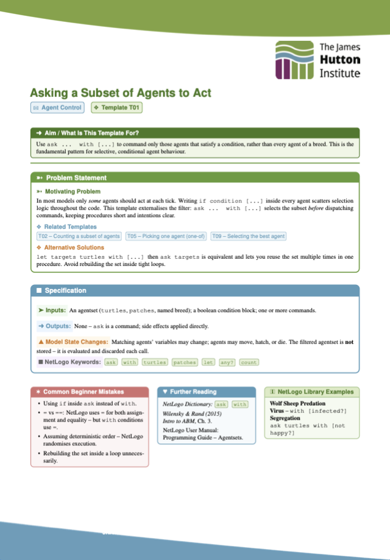
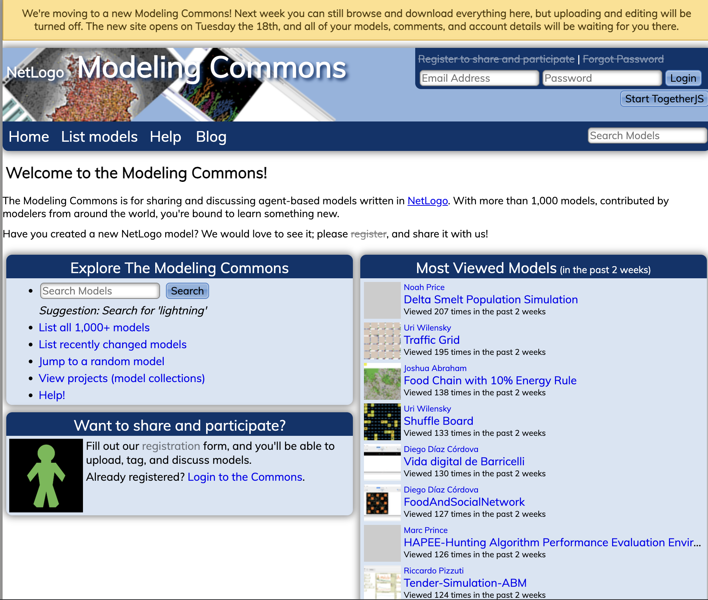
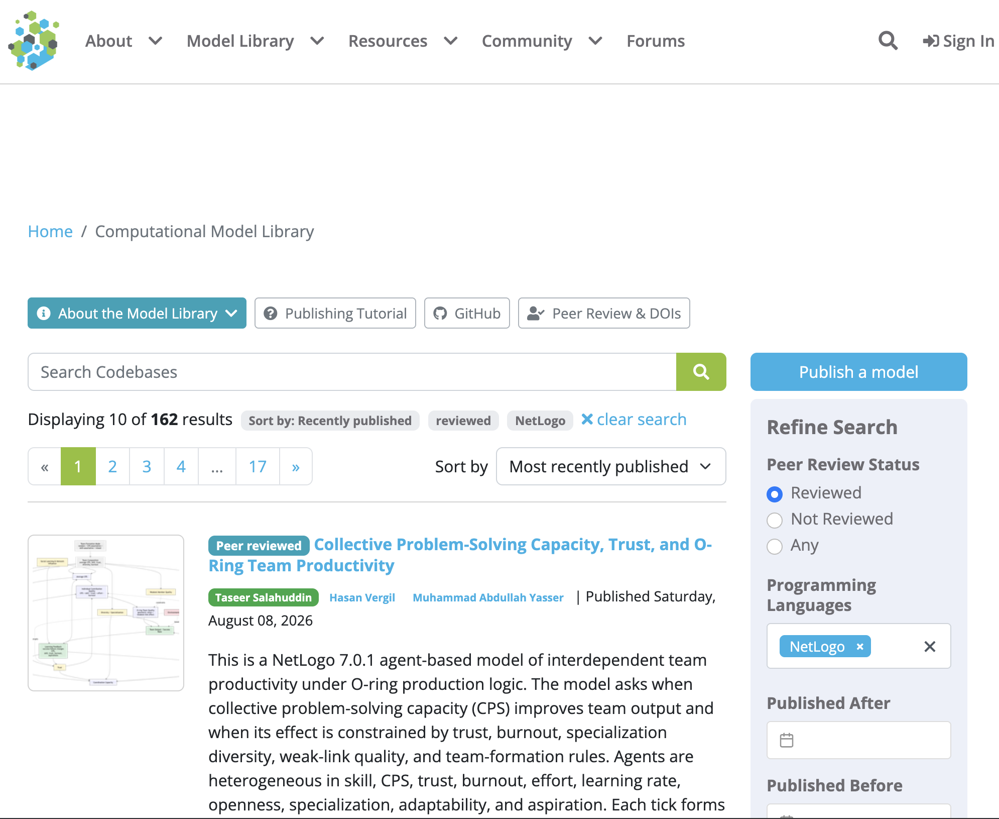
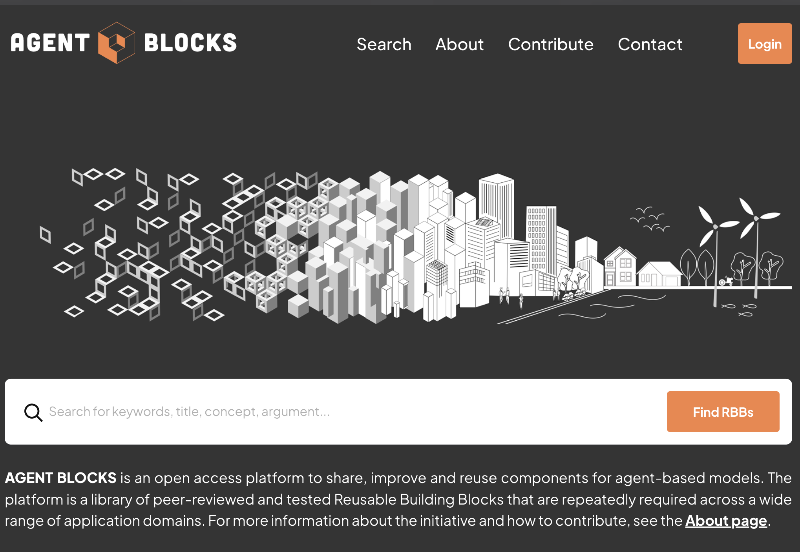
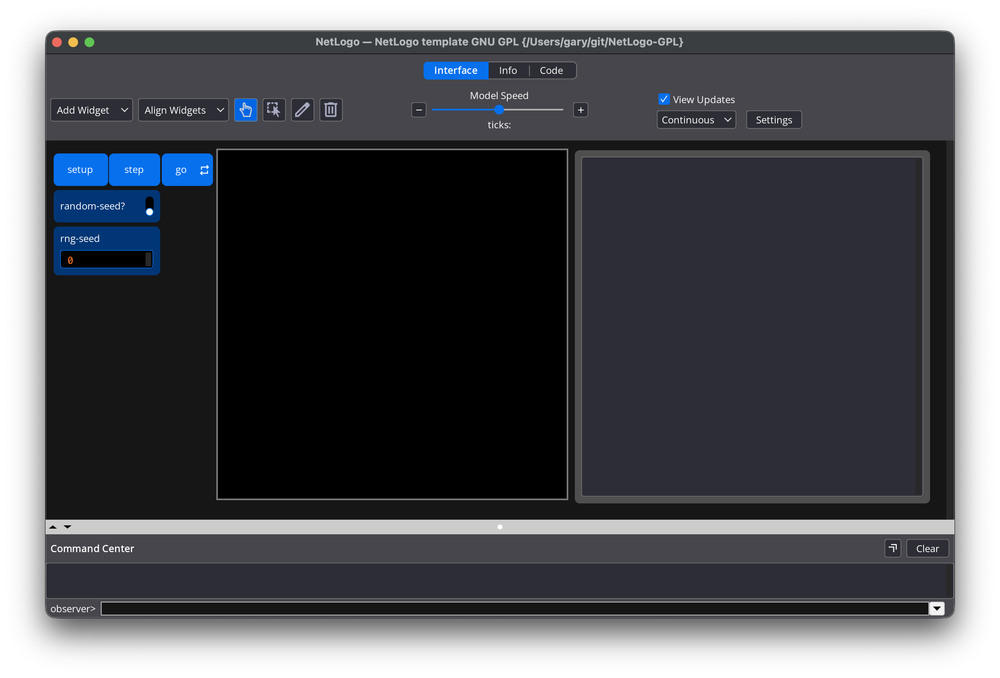
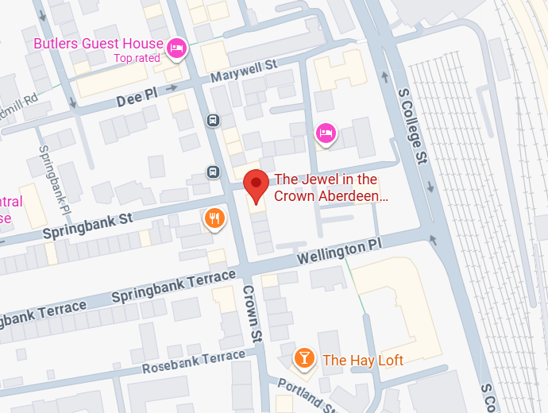
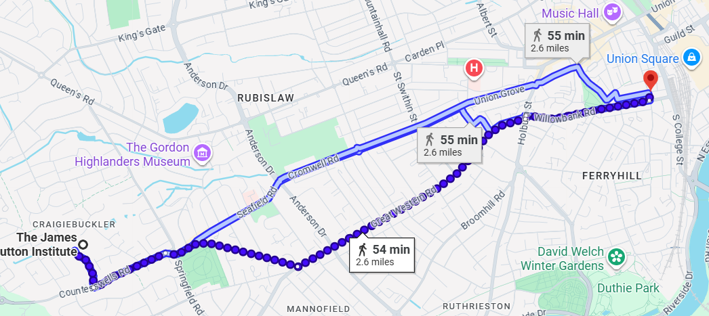

<!-- .slide: class="title-slide" -->
# Resources to help you with modelling
**Gary Polhill**

The James Hutton Institute

---

# Outline

  + How-to... templates we've made
    + And will make -- on request!

  + NetLogo's modelling commons

  + CoMSES.net's agent-based modelling archive

  + Reusable Building Blocks

  + The NetLogo-GPL template model

---

<!-- .slide: class="right-image-slide" -->

# How-to... templates

  

  + These are intended to give you some template code for common bits of functionality

  + You can then apply them to your contexts -- they are not the _whole_ answer

  + They are a new thing we are trying ... in development

  + And you can ask one of us to make a template for you

  + You will get a PDF

  

  

  

---

<!-- .slide: class="right-image-slide" -->

# Modelling commons

  

  + URL: [https://modellingcommons.org/](https://modellingcommons.org/)

  + They are moving to a new site _today_ (18 August 2026)

  + People with an account can upload their models there

  + There are over a thousand models to look through!
  
  

  

  

---

<!-- .slide: class="right-image-slide" -->

# CoMSES.net model archive

  

  + URL: [https://www.comses.net/codebases/](https://www.comses.net/codebases/)

  + A computational model library
    + Not all are in NetLogo -- but over 800 are!
    + Though some of them will be in older versions of NetLogo

  + Models can be peer-reviewed, and given a DOI

  + In active use by the social simulation community

  

  

  

---

<!-- .slide: class="right-image-slide" -->

# Reusable Building Blocks

  

  + URL: [https://www.agentblocks.org/](https://www.agentblocks.org/)

  + A new repository containing parts of models
    + See [Filatova et al. (2025) _JASSS_ 28 (4), 11](https://www.jasss.org/28/4/11.html)

  + Addressing issues of people constantly reinventing the wheel in ABM, and making post-docs and post-grads work harder on their first ABM than they need to!

  + Reusable Building Blocks are published there, and are subject to a peer-review process confirming they work
    + Like [CoMSES.net](https://www.comses.net), blocks are not necessarily in NetLogo
    + However, the algorithms and structure are published separately from their implementation in a specific programming language
    + New implementations can be added to an existing block

  

  

  

---

<!-- .slide: class="right-image-slide" -->

# NetLogo-GPL

  

  + URL: [https://github.com/garypolhill/NetLogo-GPL](https://github.com/garypolhill/NetLogo-GPL)

  + Provides a template NetLogo model

  + Original intention was just to provide a ready GNU General Public Licence NetLogo `.nlogo` (and now `.nlogox` file)
    + Standard licence text in the Info tab
    + Required statement in `setup`

  + But mission-creep :-)
    + Adds procedures for outputting different levels of exception (note, warning, error)
    + Adds procedures to help with unit-testing
    + Wraps code in `setup` and `go` in `carefully [] []` blocks so that headless runs are managed if there is a problem
    + Adds random number seed management

  

  

  

---

# TAPAS

  + "Take A Protocol and Add Something"

  + A valid approach to model development (TAMAS?)

  + Worth noting that code citation is increasingly expected

  + So if you 'borrow' some code, why not learn about code citation and how to do it?
    + Not quite settled practice, but including URLs in comments is one approach
    + Users of GitHub and Zenodo can link releases of code to an archive with a DOI, and use a `citation.cff` file in the GitHub repo to give instructions on citing code

  + You do also need to pay attention to the licence for the code
    + By default (i.e. no specific licence), you probably cannot copy it

---

# Exercise

  + Explore the resources described to see whether there might be anything useful for your group model
    + Modelling Commons: [https://modellingcommons.org/](https://modellingcommons.org/)
    + CoMSES.net's Computational Model Library: [https://www.comses.net/codebases/](https://www.comses.net/codebases/)
    + Agent Blocks: [https://www.agentblocks.org/](https://www.agentblocks.org/)
  
  + Think about what code templates you would like 
    + If you ask us now, we will have more time to prepare them!

---

## Thank you
<!-- .slide: class="final-slide" -->

With thanks to our sponsors

**BINN** and **ESSA**

---

# This evening...

There is a group dinner at _The Jewel in the Crown_, 145 Crown Street, Aberdeen (not far from Aberdeen railway station)

---

# Location and route

  + In email:
    + Google Maps location: https://maps.app.goo.gl/D9jMDNmSMAFq9Q636
    + What3Words: ///stocks.think.throw

